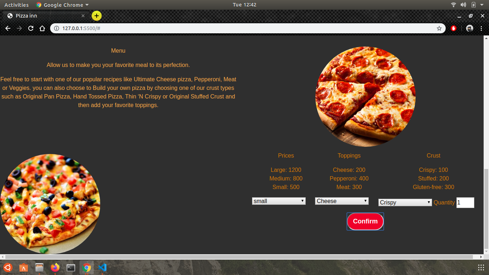
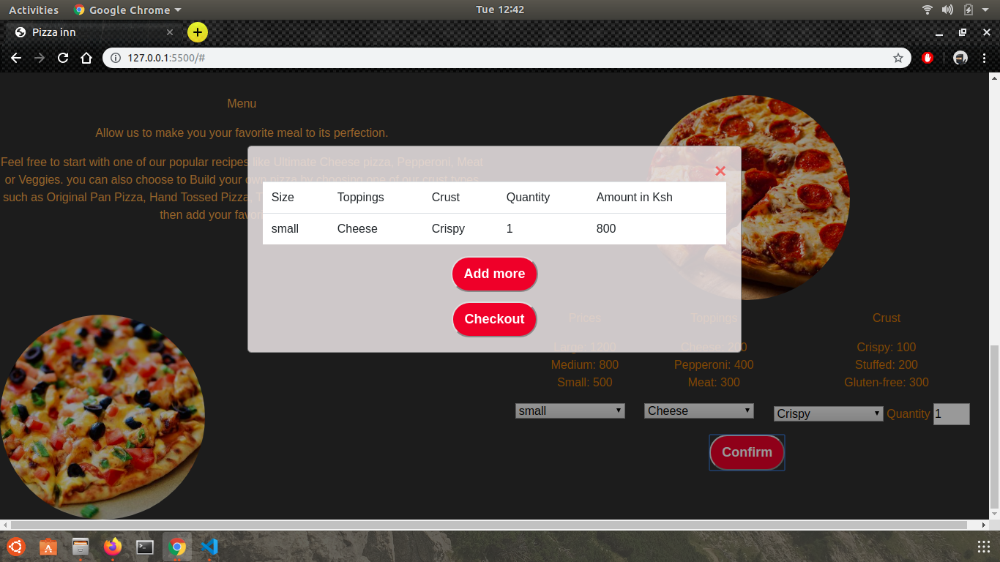

# PIZZA-WAYS
#### Pizza-ways is a website that allows a user to oder pizza, virsion: 12-11-2019
#### By * Stephen Ngumbau
## Description
Pizza-ways is a web application that was created to help pizza lovers to oder from us at the comfort of their homes. It is esentially to help us get to the masses who are probably busy at work place or have a party and would like to get their food(Pizza) quick and without the hustle of moving from where they are. Feel free to order from us today
## Setup/Installation Requirements
* Need a pc or a smart phone 
* install a web browser like (chrome, Firefox, Safari) on your device.
* Then you can open the website. Our link is https://stephenwambua.github.io/Week-four-ip/
## Technologies Used
* HTML
* CSS
* JAVASCRIPT
* BOOTSTRAP
* JQUERY
## Screenshot

This is the first page to the website

This is the area  where a user will choose the pizza size, crust and topping 

This is where the user can add or checkout their order

## Support and contact details
In case of any issues you can contact me via:
* my email which is ngumbausteph@gmail.com or
* my phone number which is +254718659266
### License
*This is an personal document that cannot be used anywhere else other than by the creater of the site*
Copyright (c) 2019
**{Swiftnet Technologies}**